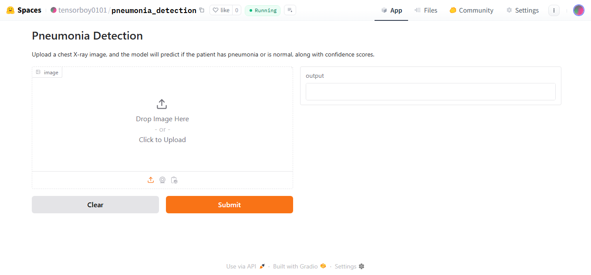
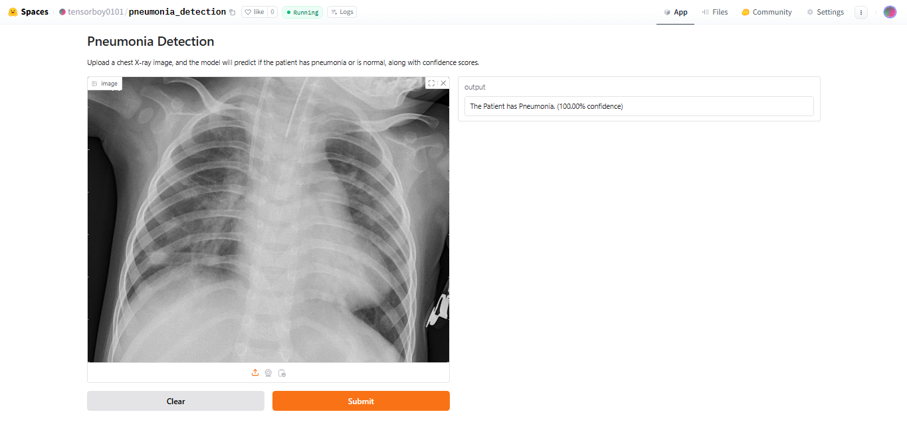

<!DOCTYPE html>
<html lang="en">
<body>

  <h1>Pneumonia Detection 🩻 </h1>

  

        <h2>1. About Website</h2>
        
<strong> Live Demo 🚀 : </strong><a href="https://huggingface.co/spaces/tensorboy0101/pneumonia_detection" target="_blank"><strong>Click Here </strong></a>

        
This website allows users to upload an X-ray image of a chest, The model will classify whether the patient is infected with Pneumonia or is Normal. along with confidence.

        <h3>Screenshots:</h3>
        
        

 
   
 

   

        <h2>2. Data</h2>
        
The dataset used for this project is sourced from Kaggle: <a href="https://www.kaggle.com/datasets/tolgadincer/labeled-chest-xray-images/data="_blank"><strong>Chest X-ray Images Dataset.</a></strong>

        
From this dataset, I selected the Chest X-ray images to train the model.

    

 

   

        <h2>3. Model Training</h2>
        
The model was trained using TensorFlow and a neural network to classify Pneumonia diseases.

        
<strong>Model Accuracy: 98.34% </strong>

        
   

   
 

  

        <h2>4. Deployment</h2>
        
The model has been deployed on Hugging Face Spaces for easy accessibility and real-time predictions.

        
Live Demo 🎯 : <a href="https://huggingface.co/spaces/tensorboy0101/pneumonia_detection" target="_blank"><strong>Click Here</a> </strong>

    

    
 

   

        <h2>Developed By</h2>
        
<strong>Tark Patel 😎 </strong>

        
Connect with me on <a href="https://www.linkedin.com/in/tark-patel/" target="_blank">LinkedIn</a>.

    

</body>
</html>
